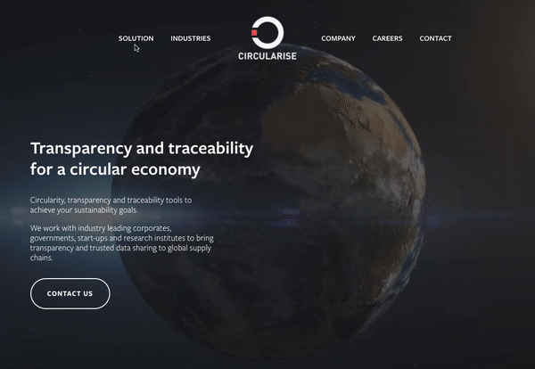

# Circularise /technology page improvements

The objective of this project is to improve the [Technology page](https://www.circularise.com/technology) of circularise.com.
On the technical side I used a Chrome extension to insert the HTML, CSS and JS when the page loads.

## Demo (TODO):



## Features:

-  Rework of the first section (of the Technology page).
-  Fully responsive

## Dev stack

-  JavaScript
-  CSS

## Project Structure (TODO)

```sh
.
├── demo/                     # This folder contains all the demo files.
│   └── demo.mov              # Quick demo in Mov format.
│   └── demo.gif              # Quick demo in GIF format.
├── icon/                     # The icon which are displayed in the Chrome's toolbar.
│   └── transparent.png       # 32*32 icon.
├── content.js                # Javascript which is injected to the page by the extension
├── manifest.json             # Config file that configure the rights and permissions for this extension
├── README.md                 # This file
└── styles.css                # CSS which is injected to the page by the extension (and override the existing styles)
```

## Usage:

Install this Chrome extension manually:

1. Download the content of this folder on Github
2. Then type in your URL: chrome://extensions/
3. Drag and drop the folder there and activate the extension.
4. Go to [circularise.com/technology](https://www.circularise.com/technology), you should now be able to see the changes.
